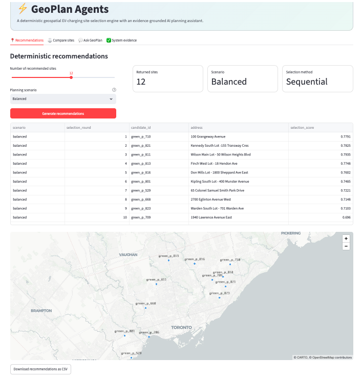
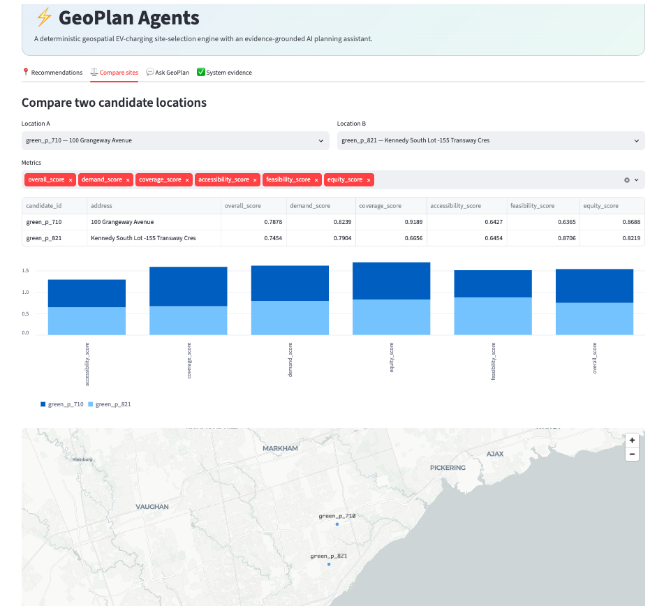
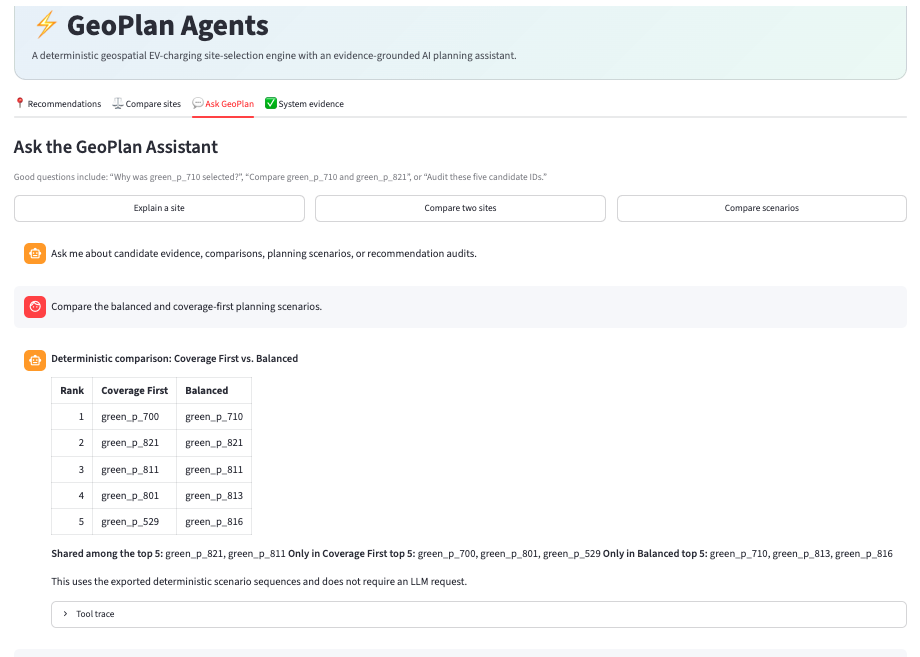
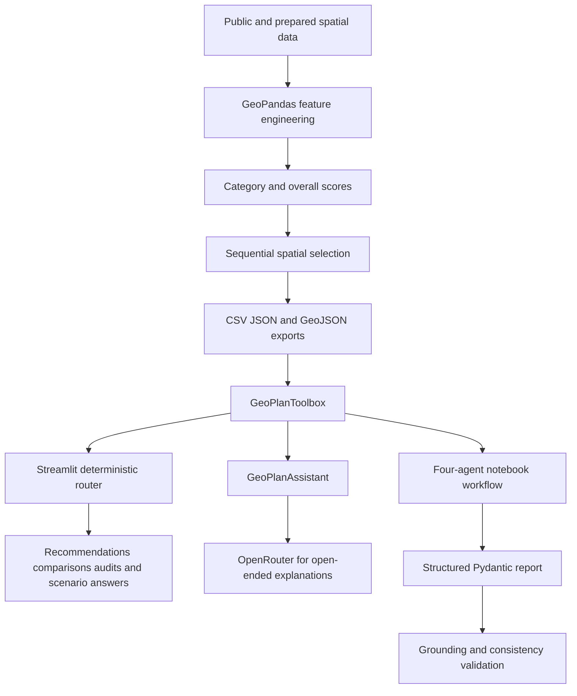

# ⚡ GeoPlan Agents

**Deterministic geospatial EV-charging site selection with an evidence-grounded AI decision-support layer**

[](https://YOUR-APP-SUBDOMAIN.streamlit.app)


> Replace `https://YOUR-APP-SUBDOMAIN.streamlit.app` with the public URL shown after deployment.

## Live demo

**Public application:**  
`https://YOUR-APP-SUBDOMAIN.streamlit.app`

The public interface lets visitors:

- explore deterministic site recommendations;
- switch between planning scenarios;
- compare two candidate locations;
- inspect maps and category scores;
- ask grounded questions about candidates and scenarios;
- review system validation and evaluation evidence.

## Project overview

GeoPlan Agents is a portfolio project for screening potential public
electric-vehicle charging locations in Toronto. It ranks a practical
candidate universe of Green P and TTC-associated parking facilities,
applies geographic constraints, and exposes the results through
deterministic tools, agent workflows, and a Streamlit web application.

The central planning question is:

> Which eligible parking facilities should be prioritized for new public
> charging infrastructure when demand, existing-charger coverage,
> accessibility, implementation feasibility, equity, and geographic
> distribution are considered together?

### Responsibility boundary

The GIS and Python pipeline is authoritative for spatial and numeric facts.

The language model does **not** independently calculate:

- distances or buffers;
- spatial joins;
- category scores;
- overall suitability scores;
- exclusion constraints;
- recommendation order.

The AI layer retrieves, compares, audits, organizes, and explains evidence
produced by the deterministic pipeline.

## Application walkthrough

The Streamlit application contains four tabs.

### 1. 📍 Recommendations



This tab presents the deterministic site-selection results.

Visitors can:

- choose the number of recommended sites;
- select a planning scenario;
- view selection rounds, candidate IDs, addresses, and scores;
- inspect the selected locations on an interactive Toronto map;
- download the displayed recommendations as a CSV file.

The current planning scenarios are:

| Scenario | Purpose |
|---|---|
| Balanced | balances demand, coverage, accessibility, feasibility, and equity |
| Coverage First | gives greater priority to locations with weaker existing charger coverage |
| Demand First | gives greater priority to nearby population and travel demand |
| Equity Balanced | increases the influence of equity-related indicators |

The recommendations are generated through sequential spatial selection.
After one location is selected, geographic separation and service-area
coverage affect the next selection round.

### 2. ⚖️ Compare sites



This tab compares two candidate locations using the same deterministic
candidate-level evidence used by the selection model.

Visitors can:

- choose two locations by candidate ID and address;
- select the metrics to compare;
- inspect the values in a comparison table;
- view category-score differences in a chart;
- see both locations on the map;
- request a grounded explanation of the comparison.

Example:

```text
Compare green_p_710 and green_p_821 using demand, coverage,
accessibility, feasibility, and equity scores.
```

Candidate IDs such as `green_p_710` are visible in the Recommendations
table and in the location selectors.

### 3. 💬 Ask GeoPlan



This tab provides a natural-language interface to the planning evidence.

Common factual requests are routed directly to deterministic Python tools.
This avoids relying on an LLM to reproduce spatial facts or invent tool
results. OpenRouter is used only when an open-ended natural-language
explanation is needed.

The expandable **Tool trace** shows which deterministic operation answered
the request.

#### Questions about one location

```text
Why was green_p_710 selected?
```

```text
Explain whether green_p_813 is a strong or weak candidate.
```

```text
What are the main strengths and concerns for green_p_821?
```

#### Comparing locations

```text
Compare green_p_710 and green_p_821 using the five category scores.
```

```text
Which location has stronger coverage: green_p_710 or green_p_821?
```

#### Comparing planning scenarios

```text
Compare the balanced and coverage-first planning scenarios.
```

```text
Show the first 10 locations under the demand-first scenario.
```

```text
Which locations appear in both the balanced and equity-balanced scenarios?
```

#### Recommendation and audit questions

```text
Return the first five deterministic selected sites in order.
```

```text
Audit green_p_710 and green_p_821.
```

```text
What are the planning weights and minimum separation distance?
```

The system may report that a requested result is unavailable when the
required deterministic export has not been generated. It should not invent
the missing result.

### 4. ✅ System evidence

The System Evidence tab presents saved validation and evaluation outputs.

It can display:

- grounding-validation status;
- structured validation checks;
- deterministic and agent evaluation summaries;
- the latest multi-agent execution trace;
- the architecture and responsibility boundary.

This tab demonstrates that fluent language is not treated as proof of
correctness. Candidate IDs, scores, addresses, selection rounds, and other
factual fields are checked against authoritative Python outputs.

## How many agents are used?

GeoPlan includes **two related agent configurations**.

### Full multi-agent research workflow: 4 agents

The notebook workflow contains four specialized agents:

| Agent | Responsibility |
|---|---|
| `PlanningCoordinator` | interprets the planning request, coordinates the workflow, and manages handoffs |
| `SiteEvidenceAgent` | retrieves candidate-level evidence and comparisons from deterministic tools |
| `ScenarioRiskAgent` | examines planning scenarios, sensitivity, trade-offs, and risks |
| `FinalReviewerAgent` | reviews the evidence, checks limitations, and prepares the final structured response |

These four agents are used in the notebook-based multi-agent workflow and
its evaluation.

### Public Streamlit application: 1 conversational assistant

The public app uses one user-facing LlamaIndex assistant:

| Component | Responsibility |
|---|---|
| `GeoPlanAssistant` | handles open-ended natural-language interaction through OpenRouter |

The public app also contains a deterministic request router and a
`GeoPlanToolbox`. These are important system components, but they are
**not agents**. They directly answer common factual requests such as
candidate comparisons, scenario comparisons, audits, and configuration
questions.

Therefore:

- **4 agents** are used in the full multi-agent notebook workflow;
- **1 separate assistant** is used by the public Streamlit interface;
- the project contains **5 named agent components overall**, but they are
  not all running together in the public app.

## System architecture



## Decision framework

The default balanced configuration uses five categories:

| Category | Interpretation | Weight |
|---|---|---:|
| Demand | nearby population, traffic activity, and apartment share | 0.30 |
| Coverage | distance from known chargers and limited nearby charger supply | 0.25 |
| Accessibility | roads, transit stops, intersections, and public destinations | 0.20 |
| Feasibility | parking capacity and simple facility-type indicators | 0.15 |
| Equity | population in service gaps and limited access to home charging | 0.10 |

Default spatial parameters:

| Parameter | Value |
|---|---:|
| Existing-charger exclusion | 100 m |
| Minimum separation between selected sites | 1,500 m |
| Prototype service radius | 1,000 m |
| Maximum recommendations | 20 |
| Analysis CRS | EPSG:26917 |
| Display CRS | EPSG:4326 |

These values are transparent planning assumptions, not universal standards.

## Deterministic tools

The read-only toolbox includes operations such as:

- `get_planning_configuration`;
- `list_available_metrics`;
- `list_candidate_ids`;
- `get_candidate`;
- `get_top_candidates`;
- `compare_candidates`;
- `get_selected_sequence`;
- `get_scenario_results`;
- `get_sensitivity_results`;
- `audit_candidate`;
- `audit_recommendation_set`.

## Repository structure

```text
geoplan-agents/
├── README.md
├── app.py
├── requirements.txt
├── .gitignore
├── .streamlit/
│   └── config.toml
├── assets/
│   ├── recommendations-tab.png
│   ├── compare-sites-tab.png
│   └── ask-geoplan-tab.png
├── data/
│   ├── DATA_GUIDE.md
│   ├── raw/
│   │   └── .gitkeep
│   └── processed/
│       ├── scored_ev_charging_candidates.geojson
│       └── selected_ev_charging_sites.geojson
├── notebooks/
│   ├── README.md
│   ├── 01_site_selection.ipynb
│   ├── 02_build_agent_tools.ipynb
│   ├── 03_multiagent_workflow.ipynb
│   └── 04_evaluate_system.ipynb
├── outputs/
│   ├── agent_candidate_summary.json
│   ├── selected_site_sequence.csv
│   ├── planning_configuration.json
│   ├── scenario_results.csv
│   ├── sensitivity_results.csv
│   ├── multiagent_trace.csv
│   ├── final_agent_report.json
│   ├── final_agent_report_validation.json
│   ├── final_agent_report_grounding.json
│   ├── agent_evaluation_cases.csv
│   └── agent_evaluation_summary.csv
└── src/
    └── geoplan_agent_tools.py
```

## Run locally

### 1. Clone the repository

```bash
git clone https://github.com/YOUR-USERNAME/geoplan-agents.git
cd geoplan-agents
```

### 2. Create an environment

```bash
conda create -n geoplan python=3.10
conda activate geoplan
```

### 3. Install dependencies

```bash
python -m pip install -r requirements.txt
```

### 4. Add the local OpenRouter secret

Create `.streamlit/secrets.toml`:

```toml
OPENROUTER_API_KEY = "sk-or-v1-YOUR-KEY"
OPENROUTER_MODEL = "openrouter/free"
OPENROUTER_FALLBACK_MODELS = ""
```

Do not commit this file.

### 5. Start the application

```bash
python -m streamlit run app.py
```

The local address is normally:

```text
http://localhost:8501
```

## Public deployment

Deploy the repository using Streamlit Community Cloud.

During deployment:

1. select the GitHub repository;
2. select the `main` branch;
3. set the entrypoint to `app.py`;
4. optionally choose a memorable app subdomain;
5. add the OpenRouter values under **Advanced settings → Secrets**;
6. deploy the application.

After deployment, replace every occurrence of:

```text
https://YOUR-APP-SUBDOMAIN.streamlit.app
```

with the actual public URL.

## Data policy

Downloaded raw datasets are intentionally excluded from version control.

The repository includes:

- source code;
- documented notebooks;
- compact derived outputs required by the demo;
- processed GeoJSON files required by the map;
- validation and evaluation summaries.

It excludes large raw source archives and locally downloaded municipal,
Census, traffic, GTFS, parks, recreation, and library datasets.

See [`data/DATA_GUIDE.md`](data/DATA_GUIDE.md) for the expected files and
official data sources.

## Limitations

- The candidate universe is limited to Green P and TTC-associated parking facilities.
- Suitability scores support planning screening and are not construction approvals.
- Electrical service capacity and utility connection availability are not confirmed.
- Construction cost, property ownership, permitting, charger utilization, and detailed site design require additional study.
- Input datasets have different dates and update frequencies.
- Traffic and accessibility variables are spatial proxies.
- Scenario results depend on selected weights, thresholds, and service radii.
- Free hosted language models may experience rate limits or inconsistent availability.
- Deterministic Python outputs remain authoritative for factual and spatial claims.

## Technology

- Python
- Pandas and NumPy
- GeoPandas and Shapely
- scikit-learn
- PyDeck
- Streamlit
- LlamaIndex
- OpenRouter
- Pydantic
- Jupyter

## Author

**Milad Saeedi**

PhD-trained researcher working at the intersection of geospatial
analytics, machine learning, environmental modelling, computer vision,
and decision-support systems.

## Acknowledgements

This project uses public information from the City of Toronto, Toronto
Transit Commission, and Statistics Canada. Source datasets remain subject
to their original licences and terms.
